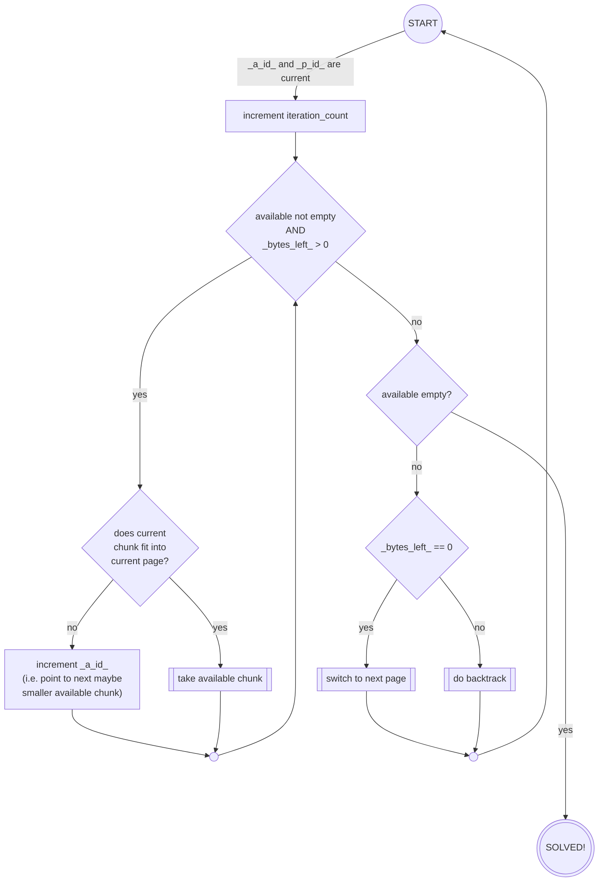
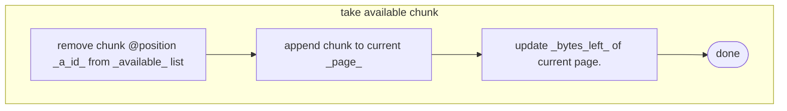
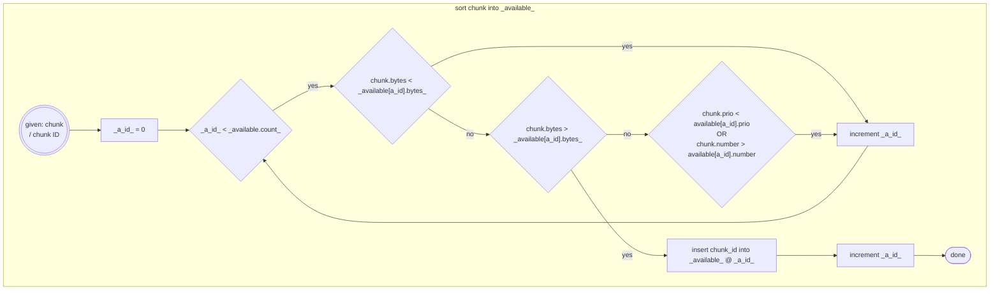

Chunk Distribution Visualizer -
description of algorithms and algorithm development
===================================================
---
## 1. Disambiguation

| word | description |
| :---: | :--- |
| chunk | A Block of data or code bytes.  For the part of finding the right place in memory, it's contents does not matter at all.  Our main interest is: its size in bytes.|
| page | A memory range to fill with chunks.  The name comes from the way 8bit processors looked at their memory, sliced into pages of 256 bytes. A page has two important parameters: <li/> where does the free space start, <li/> and how many bytes are free?

---
## 2. very first approach: the basic algorithm
With its origin in music packing, the very first idea was a simple backtracker with a big simplification:
- only the first page has less than 256 bytes free, depending on the "end of player code"
  - depending on player version, first pages in the range of \$1864-\$18af were used

The bounds were also very simple:
- go page by page, fill them till no bytes are left.

### Variables:
- `available`: a list of chunk IDs, sorted by chunk size in descending order.
- `pages`: a list of the created pages, ascending order
  - contains `start address`, `bytes_left` and a list of the currently contained `chunk_ids`
  - initially, only the starting page is added
- `a_id`: current index into the `available` list - i.e. the next chunk to be tested
- `p_id`: index of the current page being processed (for page backtracking purposes)

### Initial state:

The list `available` contains all chunk IDs and gets sorted as described by chunk size in
descending order.  Only the starting page is added to `pages`, containing an empty solution.
Both IDs are zero-initialized.

### Flow Diagrams:
#### main iteration loop:

#### sub functions:

