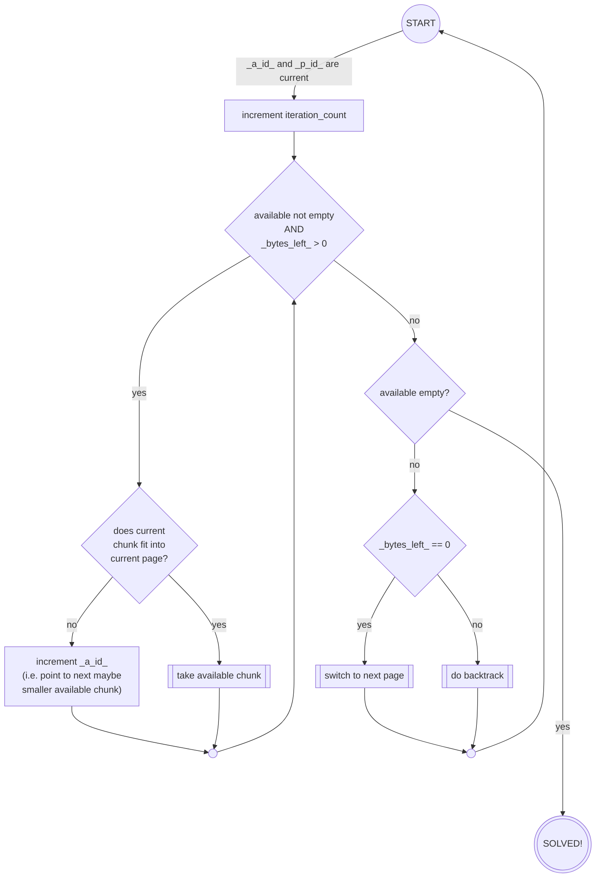
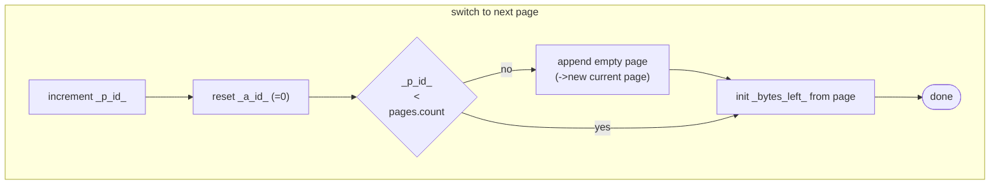
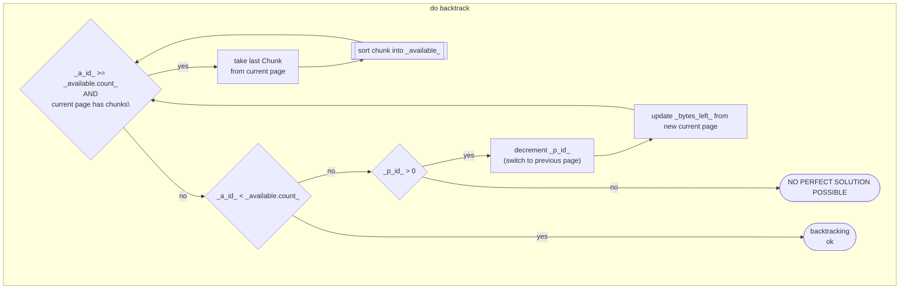
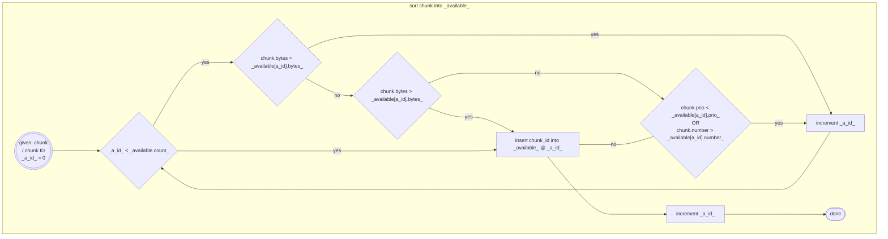
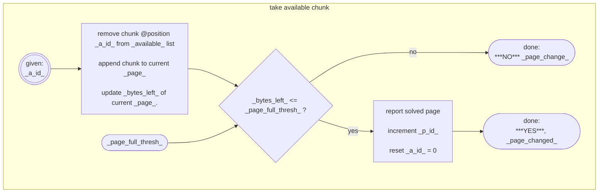
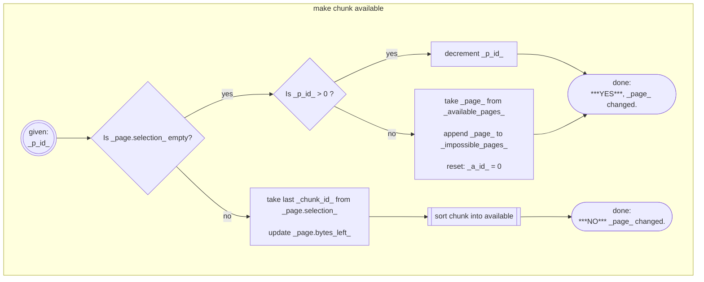
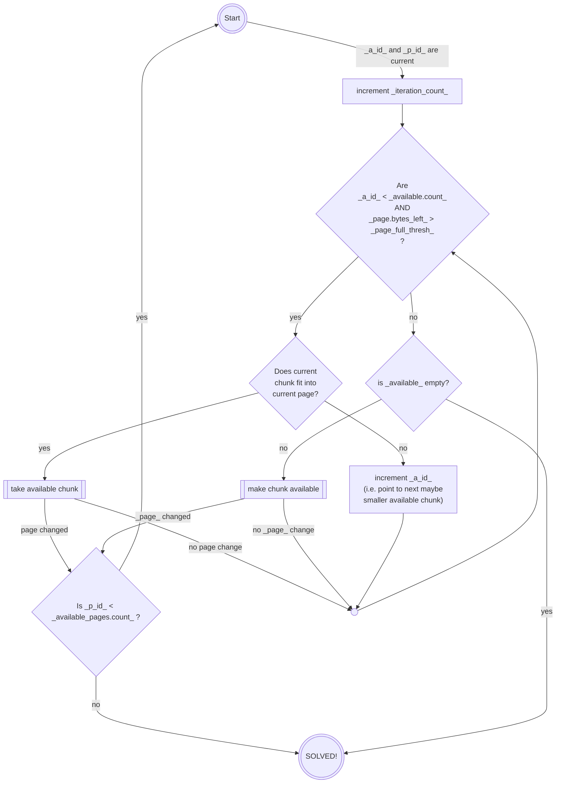

Chunk Distribution Visualizer -
description of algorithms and algorithm development
===================================================
<!--TOC-->
  - [2. very first approach: the basic algorithm](#2.-very-first-approach-the-basic-algorithm)
    - [Variables:](#variables)
    - [Initial state:](#initial-state)
    - [Flow Diagrams:](#flow-diagrams)
      - [main iteration loop:](#main-iteration-loop)
      - [sub functions:](#sub-functions)
  - [3. First abstraction - free page sizes](#3.-first-abstraction-free-page-sizes)
    - [3.1. changed flow charts](#3.1.-changed-flow-charts)
  - [3.2. verbal description](#3.2.-verbal-description)
<!--/TOC-->
| word | description |
| :---: | :--- |
| chunk | A block of data or code bytes.  For the part of finding the right place in memory, it's contents does not matter at all.  Our main interest is: its size in bytes.|
| page | A memory range to fill with chunks.  The name comes from the way 8bit processors looked at their memory, sliced into pages of 256 bytes. A page has two important parameters: <li/> where does the free space start, <li/> and how many bytes are free?

---
## 2. very first approach: the basic algorithm
With its origin in music packing, the very first idea was a simple backtracker with a big simplification:
- only the first page has less than 256 bytes free, depending on the "end of player code"
  - depending on player version, first pages in the range of \$1864-\$18af were used

The bounds were also very simple:
- go page by page, fill them till no bytes are left.

### Variables:
- `available`: a list of chunk IDs, sorted by chunk size in descending order.
- `pages`: a list of the created pages, ascending order
  - contains `start address`, `bytes_left` and a list of the currently contained `chunk_ids`
  - initially, only the starting page is added
- `a_id`: current index into the `available` list - i.e. the next chunk to be tested
- `p_id`: index of the current page being processed (for page backtracking purposes)

### Initial state:

The list `available` contains all chunk IDs and gets sorted as described by chunk size in
descending order.  Only the starting page is added to `pages`, containing an empty solution.
Both IDs are zero-initialized.

### Flow Diagrams:
#### main iteration loop:

#### sub functions:

---
## 3. First abstraction - free page sizes
The first iteration is about removing the binding to music packing.  I.e. the fixed bound that only
the first page has less that 256 bytes free needs to be removed.

Also this introduces the possibility that the smallest page(s) leave(s) too little space to be
filled with chunks.  This was nearly impossible with music data, as the instrument tables had a max
length of 32 by design, speed-tables and init-data were even shorter, and I created no player that
left less than $50 bytes in its last page.

Thus the initial situation changes:
- to ease readability and programming, a page record should contain:
  - constant: `start_address`, `end_address`
  - variable: `bytes_left`, `selection` (list of selected chunk_ids)
  - threadsafe/guarded: `solution` (list of finally selected chunk_ids for reporting/display)
- there need to be more than one list of pages
  - `pages`: a list or map of all pages configured
    - `page_id`: index into this list
  - `available_pages`: a list of page_ids, sorted by free space ascending
  - `impossible_pages`: initially empty, will contain page_ids of pages that cannot be filled with
the available chunks at all.

And we also get a new final state: `ALL_PAGES_FILLED`.  This is the "finish"-case, where there is
more data (i.e. chunks) available, than can be placed successfully inside the available pages.

Question arises, what to do in that case:
- As chunks must be left over, it could continue behind the highest pages to distribute chunks as
if those pages were marked "256 bytes free", just like the music packer did.
- On the other hand the work has succeeded, the gaps are as well-filled as possible.

Also, I changed the hard-coded "0 bytes left" rule into a configurable `page_full_thresh`old value.
If a better abort condition can be found, it would most likely retrigger the iteration with an
increased `page_full_thresh` - which is initially set to "0".

### 3.1. changed flow charts
The original `switch to next page` now nicely integrates into `take available chunk` due to the
restructuring of page objects.  To accommodate for the second "success"-option in which all fillable
given pages are filled, it now returns an indicator if a page switch happened:

---
To kind of stay within my own nomenclature, I'd like to introduce `make chunk available`.  This
actually is the backtracking or deselection step.  It now needs to take care of sorting out pages
we simply cannot fill and it returns state: if a page switch occurred.

The main iteration changes as follows:

These modifications resemble the current state of this algorithm.

## 3.2. verbal description
The algorithm uses the sorted list of available chunks to check all the chunks in descending size
order if they fit into the current page beneath the current selection.  If a chunk is found that
fits, it is selected - now the page has less space free and the algorithm continues trying for
fitting chunks.

If it cannot find any more fitting chunks and there is still space left, the current selection
obviously won't bring a solution, thus it deselects the last selected chunk - which in turn needs
to be re-inserted at the right position in the sorted list of available chunks.

The position following the reinsertion spot will be the next chunk to check if it fits - so it
continues checking from that list position on.

If a decision to deselect was made, but the current page's selection already is empty (it means:
all possibilities were tested), a page switch back must happen. In that case - if the current
page already is the smallest active page, it is marked "not solvable" and will not be considered
anymore.  A "restart" from the following page (if there's one left) will be next, so the index into
the available chunks list (`a_id`) is zeroed. 
Is that page not the smallest - i.e. there have been other pages successfully processed before -
it can continue backtracking the previous page.

If the space of a page is completely filled, a switch to the next available page will occur. In the
process of "switching up", the current testing-index into the list of available chunks is reset to
0 to accommodate to the fact that now there should be much more space left than during the latest
checks.

That way, the algorithm runs until either
- all chunks were successfully distributed
- all fillable pages were successfully filled
- all possible combinations were tested and no solution was found - which can take billions of
iterations
