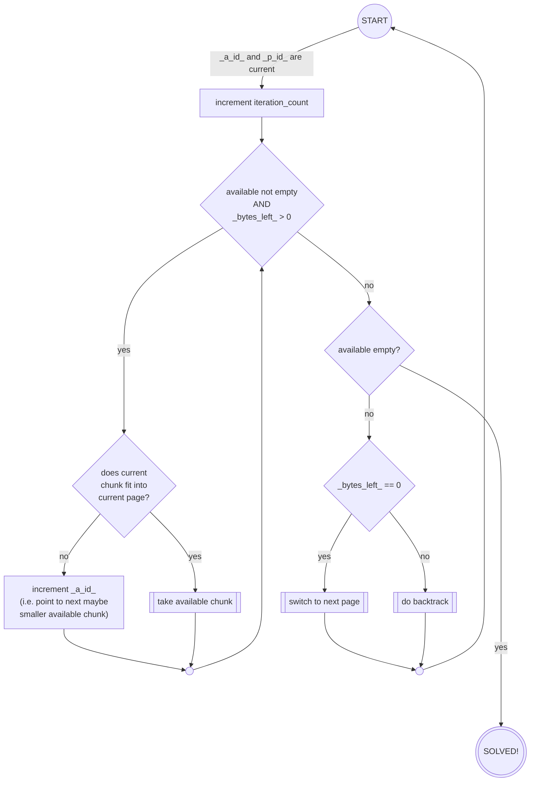
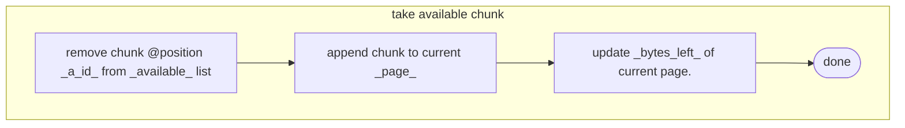
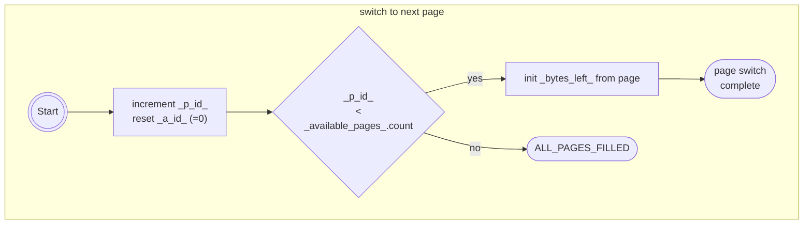
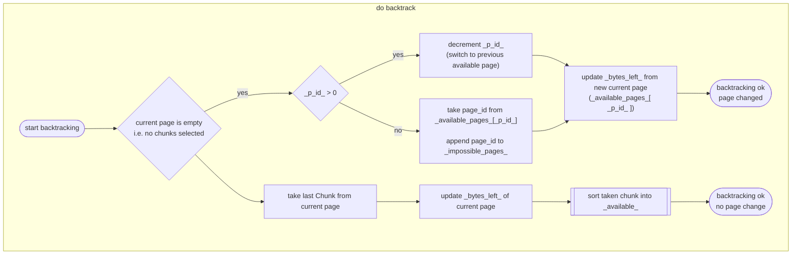
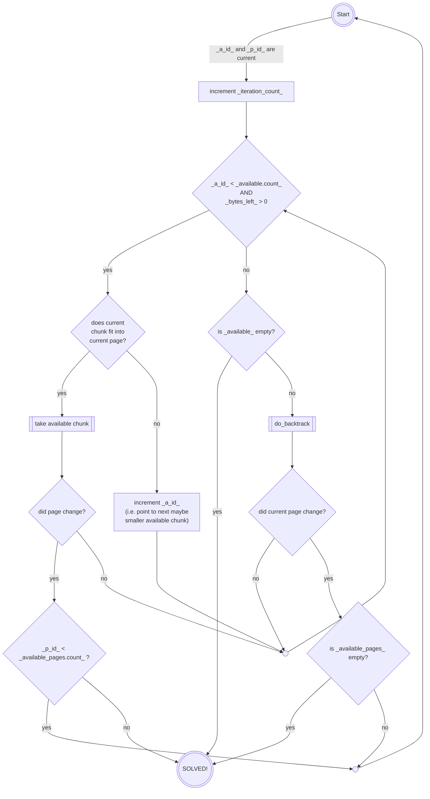

Chunk Distribution Visualizer -
description of algorithms and algorithm development
===================================================
<!--TOC-->
  - [1. Disambiguation](#1.-disambiguation)
  - [2. very first approach: the basic algorithm](#2.-very-first-approach-the-basic-algorithm)
    - [Variables:](#variables)
    - [Initial state:](#initial-state)
    - [Flow Diagrams:](#flow-diagrams)
      - [main iteration loop:](#main-iteration-loop)
      - [sub functions:](#sub-functions)
  - [3. First abstraction - free page sizes](#3.-first-abstraction-free-page-sizes)
<!--/TOC-->---
## 1. Disambiguation

| word | description |
| :---: | :--- |
| chunk | A Block of data or code bytes.  For the part of finding the right place in memory, it's contents does not matter at all.  Our main interest is: its size in bytes.|
| page | A memory range to fill with chunks.  The name comes from the way 8bit processors looked at their memory, sliced into pages of 256 bytes. A page has two important parameters: <li/> where does the free space start, <li/> and how many bytes are free?

---
## 2. very first approach: the basic algorithm
With its origin in music packing, the very first idea was a simple backtracker with a big simplification:
- only the first page has less than 256 bytes free, depending on the "end of player code"
  - depending on player version, first pages in the range of \$1864-\$18af were used

The bounds were also very simple:
- go page by page, fill them till no bytes are left.

### Variables:
- `available`: a list of chunk IDs, sorted by chunk size in descending order.
- `pages`: a list of the created pages, ascending order
  - contains `start address`, `bytes_left` and a list of the currently contained `chunk_ids`
  - initially, only the starting page is added
- `a_id`: current index into the `available` list - i.e. the next chunk to be tested
- `p_id`: index of the current page being processed (for page backtracking purposes)

### Initial state:

The list `available` contains all chunk IDs and gets sorted as described by chunk size in
descending order.  Only the starting page is added to `pages`, containing an empty solution.
Both IDs are zero-initialized.

### Flow Diagrams:
#### main iteration loop:

#### sub functions:

---
## 3. First abstraction - free page sizes
The first iteration is about removing the binding to music packing.  I.e. the fixed bound that only
the first pages has less that 256 bytes free needs to be removed.

Also this introduces the possibility that the smallest page(s) leave(s) too little space to be
filled with chunks.  This was nearly impossible with music data, as the instrument tables had a max
length of 32 by design, speed-tables and init-data were even shorter, and I created no player that
left less than $50 bytes in its last page.

Thus the initial situation changes:
- there need to be more than one list of pages
  - `pages`: a list or map of all pages configured
    - `page_id`: index into this list
  - `available_pages`: a list of page_ids, sorted by free space ascending
  - `impossible_pages`: initially empty, will contain page_ids of pages that cannot be filled with
the available chunks

And we also get a new final state: `ALL_PAGES_FILLED`.  This is the "finish"-case, where there is
more data (i.e. chunks) available, than can be placed successfully inside the available pages.

Question arises, what to do in that case:
- As chunks must be left over, it could continue behind
the highest pages to distribute chunks as if those pages were marked "256 bytes free", just like
the music packer did.
- On the other hand the work has succeeded, the gaps are as filled as possible.

### 3.1. changed flow charts
To accommodate for the second "success"-option, in which all fillable given pages are filled, 
`switch to next page` needs an update so it can return the two states:

---
Backtracking needs to take care of sorting out pages we simply cannot fill. And obviously, the
function now returns an indicator if a page change occurred during backtracking:

The main iteration changes as follows:

